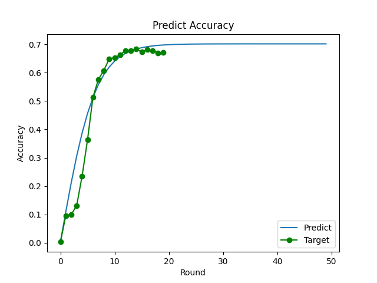

# Federated Learning Simulator _ English ver
## Project Purpose 

This simulator is proposed in the paper 'Devising Federated Learning Simulator Considering Learning Agent'. If you want more information, refer to the paper.

## Requirements
Python 3.9 version  
see `requirements.txt`

## Configurations

See `batch file` or `shell script`
- situation_script
  - save loacation
    - file_root
      - Output storage location
    - file_name_device
      - Csv file name to view Server, Client, Learning agent performance
    - file_name_round
      - Name of the csv file to see the output results for each round
    - file_name_graph 
      - The name of the png file where you can check the accuracy by round
  - parameters
    - edge_num
      - Number of clients
    - round_num
      - Number of rounds
    - model
      - Predefined models: MobileNet_v2, Inception_v3, Vgg19, SRGAN
    - dataset
      - Predefined datasets: MNIST, Cifar10, CelebA
    - server_comm
      - Communication of Server
    - client_comm
      - Communication of Client
    - l_agent_comm
      - Communication of Learning agent
    - l_agent_num
      - Number of devices connected to the Client
    - a
      - Accuracy starting point
    - b
      - Accuracy convergence point
    - p
      - Local training weights
    - q
      - Weight based on the number of devices participating in the Federated learning
- accuracy_script
  - accuracy
    - Pretrained accuracy by the user
  - predict_round
    - Round that trying to predict

## File
### `yaml` folder
- Available by adding values that user's situation
#### communication.yaml
Communication actual measurements value of Server,Client,Learning Agent  
5G, LTE, WIFI, Ethernet 1Gbps, Ethernet 500Mbps
#### dataset.yaml
Datasets used for local training  
MNIST, CIFAR10, CelebA
#### device.yaml
Learning performance of Clients and Learning agents corresponding to the model entered in `model.yaml`  
GPU(Desktop/Laptop), SoC(SmartPhone/Tablet)
#### model
Size of model available as a global model    
MobileNet V2, Inception V3, U-Net, SRGAN
### `code` folder
#### device.py
Define Server, Client, Learning agent's performance, communication, dataset, etc
#### helper.py
Define utility code
#### main.py
Working the Federated learning simulator

## Run
- move to `scripts` folder
- batch (for window)
    ``` 
    ### batch
    situation_script.bat
    accuracy_script.bat
    ```
- shell script (for linux)
    ```
    ### sh
    sh situation_script.sh
    sh accuracy_script.sh
    ```

## Results
- situation_script  

- accuracy_script  

